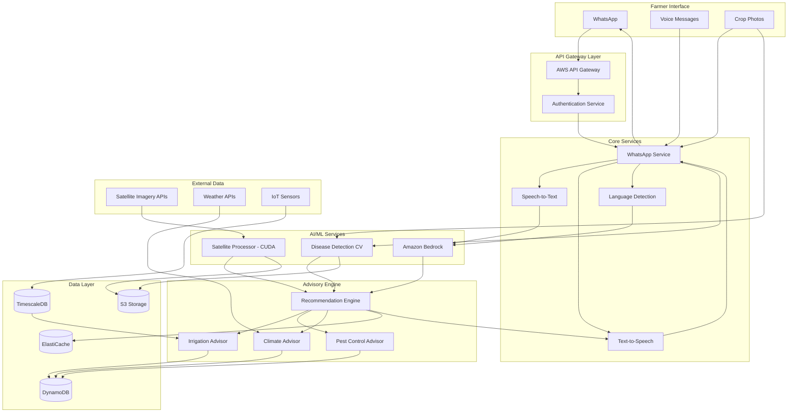

# Design Document: Agri-Vision 360

## Overview

Agri-Vision 360 is a cloud-native, AI-powered agricultural advisory system built on AWS infrastructure. The system architecture follows a microservices pattern with event-driven communication, enabling scalable processing of satellite imagery, real-time sensor data, and farmer interactions through WhatsApp.

The system consists of five major subsystems:

1. **Satellite Processing Pipeline**: CUDA-accelerated GPU processing for vegetation index extraction
2. **Computer Vision Service**: Deep learning models for crop disease identification
3. **AI Advisory Engine**: Amazon Bedrock-powered multilingual conversational AI
4. **WhatsApp Integration Layer**: Voice-first interface with speech-to-text and text-to-speech
5. **Recommendation Engine**: Core logic for irrigation, pest control, and climate advisory

The design prioritizes low latency (sub-15 second responses), cost efficiency (₹50/farmer/month), and resilience to network interruptions common in rural areas.

## Architecture

### System Architecture Diagram



### Technology Stack

**Compute:**
- AWS Lambda for serverless microservices
- AWS EC2 with NVIDIA GPUs (g4dn instances) for CUDA-accelerated satellite processing
- AWS Batch for scheduled satellite imagery processing jobs

**AI/ML:**
- Amazon Bedrock (Claude 3 or Llama models) for multilingual conversational AI
- Amazon Transcribe for speech-to-text (22 Indian languages)
- Amazon Polly for text-to-speech
- Custom PyTorch models on SageMaker for disease detection
- CUDA 12.x for GPU-accelerated image processing

**Storage:**
- Amazon DynamoDB for farmer profiles, field data, and advisory history
- Amazon S3 for satellite imagery, crop photos, and model artifacts
- TimescaleDB on RDS for time-series sensor data
- Amazon ElastiCache (Redis) for response caching and session management

**Integration:**
- AWS API Gateway for REST APIs
- Amazon EventBridge for event-driven architecture
- Amazon SQS for message queuing and retry logic
- WhatsApp Business API for farmer communication

**Monitoring:**
- Amazon CloudWatch for logs and metrics
- AWS X-Ray for distributed tracing
- Custom dashboards for impact metrics

## Components and Interfaces

### 1. WhatsApp Service

**Responsibilities:**
- Receive and send messages via WhatsApp Business API
- Route voice messages to speech-to-text service
- Route photos to disease detection service
- Manage conversation state and context
- Handle message queuing for offline scenarios

**Interfaces:**

```python
class WhatsAppService:
    def receive_message(self, webhook_payload: dict) -> MessageEvent:
        """
        Process incoming WhatsApp webhook events.
        
        Args:
            webhook_payload: Raw webhook data from WhatsApp
            
        Returns:
            Parsed MessageEvent with type, content, and farmer_id
        """
        pass
    
    def send_text_message(self, farmer_id: str, message: str, language: str) -> bool:
        """
        Send text message to farmer.
        
        Args:
            farmer_id: Unique farmer identifier
            message: Message content in specified language
            language: ISO 639-1 language code
            
        Returns:
            Success status
        """
        pass
    
    def send_voice_message(self, farmer_id: str, audio_url: str) -> bool:
        """
        Send voice message to farmer.
        
        Args:
            farmer_id: Unique farmer identifier
            audio_url: S3 URL of synthesized audio
            
        Returns:
            Success status
        """
        pass
    
    def queue_message(self, farmer_id: str, message: dict) -> str:
        """
        Queue message for delivery when farmer is online.
        
        Args:
            farmer_id: Unique farmer identifier
            message: Message payload
            
        Returns:
            Queue message ID
        """
        pass
```

### 2. Speech Processing Service

**Responsibilities:**
- Transcribe voice messages to text using Amazon Transcribe
- Detect language from audio
- Synthesize text responses to speech using Amazon Polly
- Handle audio format conversion

**Interfaces:**

```python
class SpeechProcessingService:
    def transcribe_audio(self, audio_url: str, language_hint: str = None) -> TranscriptionResult:
        """
        Transcribe audio to text.
        
        Args:
            audio_url: S3 URL of audio file
            language_hint: Optional language code for better accuracy
            
        Returns:
            TranscriptionResult with text, confidence, and detected language
        """
        pass
    
    def synthesize_speech(self, text: str, language: str, voice_id: str = None) -> str:
        """
        Convert text to speech.
        
        Args:
            text: Text to synthesize
            language: Target language code
            voice_id: Optional specific voice selection
            
        Returns:
            S3 URL of generated audio file
        """
        pass
    
    def detect_language(self, audio_url: str) -> LanguageDetectionResult:
        """
        Detect language from audio.
        
        Args:
            audio_url: S3 URL of audio file
            
        Returns:
            LanguageDetectionResult with language code and confidence
        """
        pass
```

### 3. Satellite Processing Service

**Responsibilities:**
- Fetch satellite imagery from providers (Sentinel-2, Landsat)
- Process imagery using CUDA-accelerated algorithms
- Calculate vegetation indices (NDVI, EVI, SAVI)
- Detect crop health anomalies
- Store processed results in S3 and metadata in DynamoDB

**Interfaces:**

```python
class SatelliteProcessingService:
    def fetch_imagery(self, field_bounds: FieldBoundary, date_range: DateRange) -> List[SatelliteImage]:
        """
        Fetch satellite imagery for field.
        
        Args:
            field_bounds: Geographic boundary of field
            date_range: Time range for imagery
            
        Returns:
            List of available satellite images
        """
        pass
    
    def process_imagery_cuda(self, image: SatelliteImage) -> VegetationIndices:
        """
        Process satellite imagery using CUDA acceleration.
        
        Args:
            image: Raw satellite image data
            
        Returns:
            VegetationIndices with NDVI, EVI, SAVI values
        """
        pass
    
    def calculate_crop_health(self, indices: VegetationIndices, crop_type: str, growth_stage: str) -> CropHealthIndex:
        """
        Calculate crop health score.
        
        Args:
            indices: Vegetation indices from satellite
            crop_type: Type of crop being monitored
            growth_stage: Current growth stage
            
        Returns:
            CropHealthIndex with score and anomaly flags
        """
        pass
    
    def detect_anomalies(self, current: VegetationIndices, historical: List[VegetationIndices]) -> List[Anomaly]:
        """
        Detect anomalies by comparing current vs historical data.
        
        Args:
            current: Current vegetation indices
            historical: Historical indices for comparison
            
        Returns:
            List of detected anomalies with severity
        """
        pass
```

### 4. Disease Detection Service

**Responsibilities:**
- Receive crop photos from farmers
- Preprocess images for model input
- Run inference using trained PyTorch models
- Identify diseases with confidence scores
- Return results in farmer's language

**Interfaces:**

```python
class DiseaseDetectionService:
    def detect_disease(self, image_url: str, crop_type: str) -> DiseaseDetectionResult:
        """
        Detect crop diseases from photo.
        
        Args:
            image_url: S3 URL of crop photo
            crop_type: Type of crop in photo
            
        Returns:
            DiseaseDetectionResult with diseases, confidence, and recommendations
        """
        pass
    
    def preprocess_image(self, image: Image) -> Tensor:
        """
        Preprocess image for model inference.
        
        Args:
            image: Raw image data
            
        Returns:
            Preprocessed tensor ready for model
        """
        pass
    
    def validate_image_quality(self, image: Image) -> ImageQualityResult:
        """
        Check if image quality is sufficient for analysis.
        
        Args:
            image: Image to validate
            
        Returns:
            ImageQualityResult with quality score and issues
        """
        pass
    
    def get_treatment_recommendations(self, disease: Disease, crop_type: str) -> List[Treatment]:
        """
        Get treatment recommendations for detected disease.
        
        Args:
            disease: Detected disease
            crop_type: Type of crop affected
            
        Returns:
            List of treatment options prioritized by effectiveness and safety
        """
        pass
```

### 5. AI Advisory Service

**Responsibilities:**
- Interface with Amazon Bedrock for natural language understanding
- Maintain conversation context
- Generate responses in farmer's language
- Route queries to appropriate recommendation engines
- Explain technical concepts in simple terms

**Interfaces:**

```python
class AIAdvisoryService:
    def process_query(self, farmer_id: str, query: str, language: str, context: ConversationContext) -> AdvisoryResponse:
        """
        Process farmer query and generate response.
        
        Args:
            farmer_id: Unique farmer identifier
            query: Farmer's question or statement
            language: Language of interaction
            context: Previous conversation context
            
        Returns:
            AdvisoryResponse with answer and updated context
        """
        pass
    
    def generate_response(self, intent: Intent, data: dict, language: str) -> str:
        """
        Generate natural language response using Bedrock.
        
        Args:
            intent: Classified intent of query
            data: Relevant data for response
            language: Target language
            
        Returns:
            Natural language response
        """
        pass
    
    def classify_intent(self, query: str, context: ConversationContext) -> Intent:
        """
        Classify farmer's intent from query.
        
        Args:
            query: Farmer's query text
            context: Conversation context
            
        Returns:
            Classified intent (irrigation, pest, disease, weather, etc.)
        """
        pass
    
    def simplify_technical_terms(self, text: str, language: str) -> str:
        """
        Replace technical terms with simple explanations.
        
        Args:
            text: Text with technical terms
            language: Target language
            
        Returns:
            Simplified text
        """
        pass
```

### 6. Recommendation Engine

**Responsibilities:**
- Aggregate data from satellite, sensors, weather, and disease detection
- Generate irrigation schedules based on crop water requirements
- Calculate pest risk scores
- Provide climate-based crop recommendations
- Track recommendation effectiveness

**Interfaces:**

```python
class RecommendationEngine:
    def generate_irrigation_schedule(self, field_id: str, date: datetime) -> IrrigationSchedule:
        """
        Generate irrigation recommendations.
        
        Args:
            field_id: Unique field identifier
            date: Date for recommendations
            
        Returns:
            IrrigationSchedule with timing, duration, and water amount
        """
        pass
    
    def calculate_pest_risk(self, field_id: str) -> PestRiskAssessment:
        """
        Calculate pest infestation risk.
        
        Args:
            field_id: Unique field identifier
            
        Returns:
            PestRiskAssessment with risk score and recommended actions
        """
        pass
    
    def generate_climate_advisory(self, field_id: str, forecast_days: int) -> ClimateAdvisory:
        """
        Generate climate-based recommendations.
        
        Args:
            field_id: Unique field identifier
            forecast_days: Number of days to forecast
            
        Returns:
            ClimateAdvisory with warnings and protective measures
        """
        pass
    
    def recommend_crop_varieties(self, location: Location, season: str) -> List[CropRecommendation]:
        """
        Recommend climate-resilient crop varieties.
        
        Args:
            location: Geographic location
            season: Planting season
            
        Returns:
            List of recommended crops with rationale
        """
        pass
    
    def track_recommendation_outcome(self, recommendation_id: str, outcome: Outcome) -> None:
        """
        Track whether recommendation was followed and outcome.
        
        Args:
            recommendation_id: Unique recommendation identifier
            outcome: Farmer-reported outcome
        """
        pass
```

### 7. Sensor Data Service

**Responsibilities:**
- Ingest data from IoT sensors (soil moisture, temperature, humidity)
- Validate and clean sensor readings
- Store time-series data in TimescaleDB
- Detect sensor anomalies and failures
- Provide aggregated sensor metrics

**Interfaces:**

```python
class SensorDataService:
    def ingest_sensor_data(self, sensor_id: str, readings: List[SensorReading]) -> bool:
        """
        Ingest sensor readings.
        
        Args:
            sensor_id: Unique sensor identifier
            readings: List of sensor readings with timestamps
            
        Returns:
            Success status
        """
        pass
    
    def get_latest_readings(self, field_id: str) -> FieldSensorData:
        """
        Get latest sensor readings for field.
        
        Args:
            field_id: Unique field identifier
            
        Returns:
            FieldSensorData with latest readings from all sensors
        """
        pass
    
    def get_historical_data(self, field_id: str, date_range: DateRange) -> List[FieldSensorData]:
        """
        Get historical sensor data.
        
        Args:
            field_id: Unique field identifier
            date_range: Time range for data
            
        Returns:
            List of historical sensor readings
        """
        pass
    
    def validate_reading(self, reading: SensorReading, sensor_type: str) -> ValidationResult:
        """
        Validate sensor reading for anomalies.
        
        Args:
            reading: Sensor reading to validate
            sensor_type: Type of sensor
            
        Returns:
            ValidationResult with validity flag and issues
        """
        pass
    
    def detect_sensor_failure(self, sensor_id: str) -> SensorHealthStatus:
        """
        Detect if sensor has failed or needs maintenance.
        
        Args:
            sensor_id: Unique sensor identifier
            
        Returns:
            SensorHealthStatus with health indicators
        """
        pass
```

## Data Models

### Core Entities

```python
from dataclasses import dataclass
from datetime import datetime
from typing import List, Optional, Dict
from enum import Enum

@dataclass
class Farmer:
    """Farmer profile and registration data."""
    farmer_id: str
    phone_number: str
    name: str
    preferred_language: str  # ISO 639-1 code
    location: Location
    registration_date: datetime
    fields: List[str]  # List of field IDs
    notification_preferences: NotificationPreferences
    
@dataclass
class Location:
    """Geographic location."""
    latitude: float
    longitude: float
    district: str
    state: str
    pincode: str

@dataclass
class Field:
    """Agricultural field information."""
    field_id: str
    farmer_id: str
    boundary: FieldBoundary
    area_hectares: float
    crop_type: str
    sowing_date: datetime
    expected_harvest_date: datetime
    soil_type: str
    irrigation_method: str
    sensors: List[str]  # List of sensor IDs
    
@dataclass
class FieldBoundary:
    """Geographic boundary of field."""
    coordinates: List[tuple[float, float]]  # List of (lat, lon) points
    
@dataclass
class SatelliteImage:
    """Satellite imagery data."""
    image_id: str
    field_id: str
    acquisition_date: datetime
    satellite_source: str  # "Sentinel-2", "Landsat-8"
    cloud_cover_percent: float
    resolution_meters: float
    bands: Dict[str, str]  # Band name -> S3 URL
    
@dataclass
class VegetationIndices:
    """Calculated vegetation indices."""
    field_id: str
    calculation_date: datetime
    ndvi: float  # Normalized Difference Vegetation Index
    evi: float   # Enhanced Vegetation Index
    savi: float  # Soil Adjusted Vegetation Index
    ndwi: float  # Normalized Difference Water Index
    
@dataclass
class CropHealthIndex:
    """Crop health assessment."""
    field_id: str
    assessment_date: datetime
    health_score: float  # 0-100
    status: str  # "Excellent", "Good", "Fair", "Poor", "Critical"
    anomalies: List[Anomaly]
    recommendations: List[str]
    
@dataclass
class Anomaly:
    """Detected anomaly in field."""
    anomaly_type: str  # "water_stress", "nutrient_deficiency", "pest_damage"
    severity: str  # "Low", "Medium", "High", "Critical"
    affected_area_percent: float
    location: Optional[Location]
    detected_date: datetime
    
@dataclass
class DiseaseDetectionResult:
    """Result of disease detection from photo."""
    detection_id: str
    field_id: str
    image_url: str
    detection_date: datetime
    diseases: List[DetectedDisease]
    image_quality_score: float
    
@dataclass
class DetectedDisease:
    """Individual detected disease."""
    disease_name: str
    disease_name_local: str  # In farmer's language
    confidence: float
    severity: str
    affected_area_estimate: str
    treatments: List[Treatment]
    
@dataclass
class Treatment:
    """Disease treatment recommendation."""
    treatment_type: str  # "Organic", "Chemical", "Cultural"
    method: str
    products: List[str]
    dosage: str
    timing: str
    safety_precautions: List[str]
    estimated_cost: float
    
@dataclass
class SensorReading:
    """Individual sensor reading."""
    sensor_id: str
    timestamp: datetime
    reading_type: str  # "soil_moisture", "temperature", "humidity"
    value: float
    unit: str
    
@dataclass
class FieldSensorData:
    """Aggregated sensor data for field."""
    field_id: str
    timestamp: datetime
    soil_moisture_percent: Optional[float]
    soil_temperature_celsius: Optional[float]
    air_temperature_celsius: Optional[float]
    humidity_percent: Optional[float]
    
@dataclass
class IrrigationSchedule:
    """Irrigation recommendations."""
    schedule_id: str
    field_id: str
    generated_date: datetime
    valid_until: datetime
    recommendations: List[IrrigationRecommendation]
    
@dataclass
class IrrigationRecommendation:
    """Single irrigation recommendation."""
    date: datetime
    time_of_day: str
    duration_minutes: int
    water_amount_liters: float
    priority: str  # "Critical", "High", "Medium", "Low"
    rationale: str
    
@dataclass
class PestRiskAssessment:
    """Pest risk evaluation."""
    assessment_id: str
    field_id: str
    assessment_date: datetime
    risk_score: float  # 0-100
    risk_level: str  # "Low", "Medium", "High", "Critical"
    likely_pests: List[PestInfo]
    preventive_measures: List[str]
    monitoring_frequency: str
    
@dataclass
class PestInfo:
    """Information about specific pest."""
    pest_name: str
    pest_name_local: str
    probability: float
    damage_potential: str
    signs_to_watch: List[str]
    
@dataclass
class ClimateAdvisory:
    """Climate-based recommendations."""
    advisory_id: str
    field_id: str
    issue_date: datetime
    forecast_period: DateRange
    warnings: List[WeatherWarning]
    recommendations: List[str]
    
@dataclass
class WeatherWarning:
    """Extreme weather warning."""
    warning_type: str  # "Frost", "Heatwave", "Heavy_Rain", "Drought"
    severity: str
    start_date: datetime
    end_date: datetime
    protective_measures: List[str]
    
@dataclass
class ConversationContext:
    """Context for AI conversation."""
    farmer_id: str
    session_id: str
    language: str
    message_history: List[Message]
    current_intent: Optional[str]
    entities: Dict[str, any]
    
@dataclass
class Message:
    """Single message in conversation."""
    message_id: str
    timestamp: datetime
    sender: str  # "farmer" or "system"
    content: str
    message_type: str  # "text", "voice", "image"
    
@dataclass
class AdvisoryResponse:
    """Response from AI advisory."""
    response_id: str
    farmer_id: str
    timestamp: datetime
    response_text: str
    response_audio_url: Optional[str]
    intent: str
    confidence: float
    follow_up_questions: List[str]
    updated_context: ConversationContext
    
@dataclass
class DateRange:
    """Date range for queries."""
    start_date: datetime
    end_date: datetime
    
@dataclass
class NotificationPreferences:
    """Farmer notification settings."""
    enable_voice: bool
    enable_text: bool
    quiet_hours_start: str  # "22:00"
    quiet_hours_end: str    # "06:00"
    critical_alerts_override: bool
```

### Database Schema

**DynamoDB Tables:**

1. **Farmers Table**
   - Partition Key: `farmer_id`
   - Attributes: All Farmer model fields
   - GSI: `phone_number-index` for lookup by phone

2. **Fields Table**
   - Partition Key: `field_id`
   - Sort Key: `farmer_id`
   - Attributes: All Field model fields
   - GSI: `farmer_id-index` for farmer's fields lookup

3. **Advisories Table**
   - Partition Key: `field_id`
   - Sort Key: `timestamp`
   - Attributes: Advisory data (irrigation, pest, climate)
   - TTL: 90 days for automatic cleanup

4. **Conversations Table**
   - Partition Key: `farmer_id`
   - Sort Key: `session_id#timestamp`
   - Attributes: Message history
   - TTL: 30 days

5. **Disease Detections Table**
   - Partition Key: `field_id`
   - Sort Key: `detection_date`
   - Attributes: DiseaseDetectionResult fields

**TimescaleDB Tables:**

1. **sensor_readings** (hypertable)
   - Partitioned by time
   - Columns: sensor_id, timestamp, reading_type, value, unit
   - Retention: 1 year

2. **field_aggregates** (continuous aggregate)
   - Hourly aggregates of sensor data per field
   - Columns: field_id, hour, avg_soil_moisture, avg_temperature, etc.

**S3 Buckets:**

1. **satellite-imagery-raw**: Raw satellite images
2. **satellite-imagery-processed**: Processed images with indices
3. **crop-photos**: Farmer-uploaded crop photos
4. **audio-files**: Voice messages and synthesized speech
5. **ml-models**: Trained model artifacts

